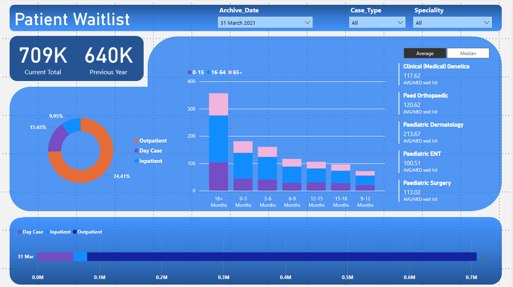
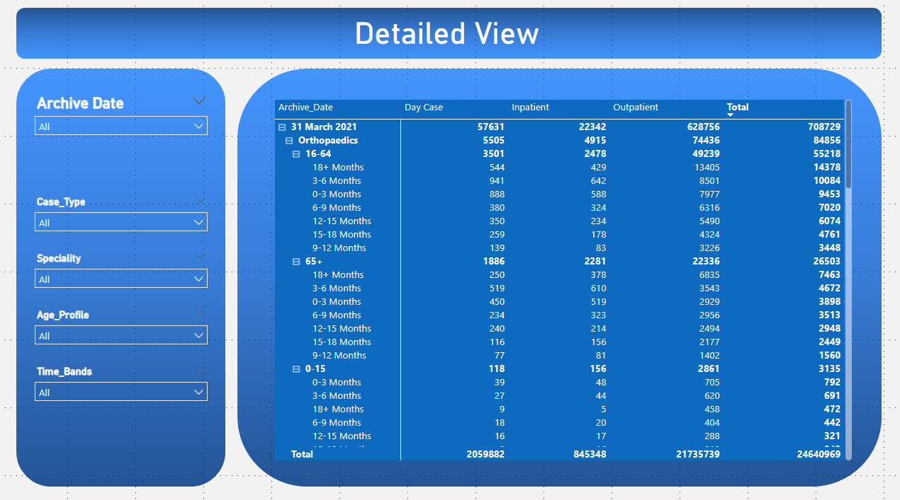
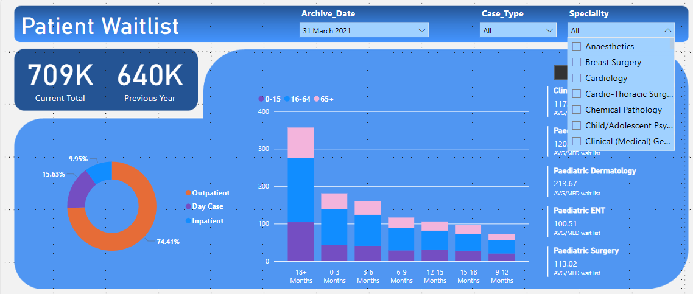
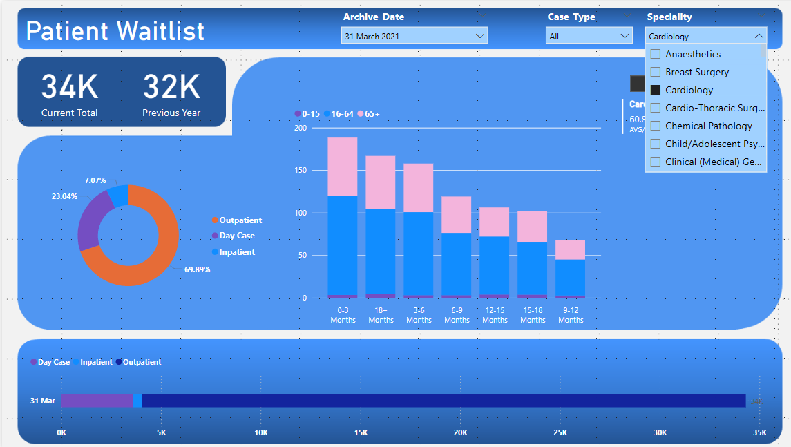
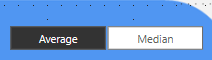

# Patient-Wait-List-Dashboard

 ## Project Overview
 
 - Data Cleaning:
    - Create a duplicate copy and combine inpatient and outpatient data sets.
    - Combing through the data set and identifying any issues.
    - Perform trimming, replacements and correct any input errors.
 - Planning Dashboard:
    - Consider the purpose, shareholder and design.
    - Will one dashboard be enough?
 - Dashboard:
    - Create multiple visualisations that all correlate with the purpose of the dashboard.
    - Utilise DAX to allow for powerful filtering capabilities.
    - Finally check in with shareholder for feedback.

 ## Data Cleaning

 After a careful comb of the data, I immediately noticed multiple issues.
 1. The column naming in both sets was different and needed correction before merging into a single set.
 2. Numerous inputs had spelling errors.
 3. Time bands had uneccesary bands, for example
        1 to 3 months, 1 to 6 months etc.
    After using Trim this issue was easily resolved, the same process was carried out for age brackets.
 4. In the combined set I also noticed a difference between the two sets in an entry for 18 + months, being 18 months + in one set and the prior in the other. 

 

 ## Planning 

 With a clean data set to work off it was time to carefully think about what my dashboard aims to achieve.
 1. Our data is based off a medical waiting list similiar to the NHS, what data would we want to show?
 2. What is the goal of this dashboard? To compare the waiting list from the current date to 12 months prior and show which case type has the longest build up.
 3. Who is the user of the dashboard? how complex can the visualisations be?
 4. Visual Style

 ## Interactive Dashboards

 Finishing the planning process of the dashboard, I decided that it would be better to make 2 dashboards
 1. A summarised view that is easy to look at and get valuable insight into the data.
 2. A detailed view using a matrix with strong filtering capabilities to target very specific data.

 

 

Each visualisation has filtering capability and there's provided filters to allow for more distinct filters.

 

Use the provided filters for a more robust filter choice:

 

With left click you may also click on any value in a visualisation to filter by that metric

 ## Extras

 To create the visual style used as the canvas backgrounds in the dashboards I used Powerpoint.
 Take a snippet of your dashboard and paste it into a presentation slide and use shapes to style it.
 Once done save it as png and select it in PowerBI

 

 

The DAX I used for measures are the following:
1. Current Total = CALCULATE(SUM('Combined Data'[Total]),'Combined Data'[Archive_Date] = MAX('Combined Data'[Archive_Date])) - Gets the current waiting list
2. Previous Year = CALCULATE(SUM('Combined Data'[Total]), 'Combined Data'[Archive_Date] = EDATE(MAX('Combined Data'[Archive_Date]), -12)) 
3. Average wait list = AVERAGE('Combined Data'[Total])
4. Median wait list = MEDIAN('Combined Data'[Total])
5. AVG/MED wait list = SWITCH(VALUES('Calculation Method'[Calc Method]), "Average", [Average wait list], "Median", [Median wait list])
 - This DAX was used for my switch function in the dashboard.

 

